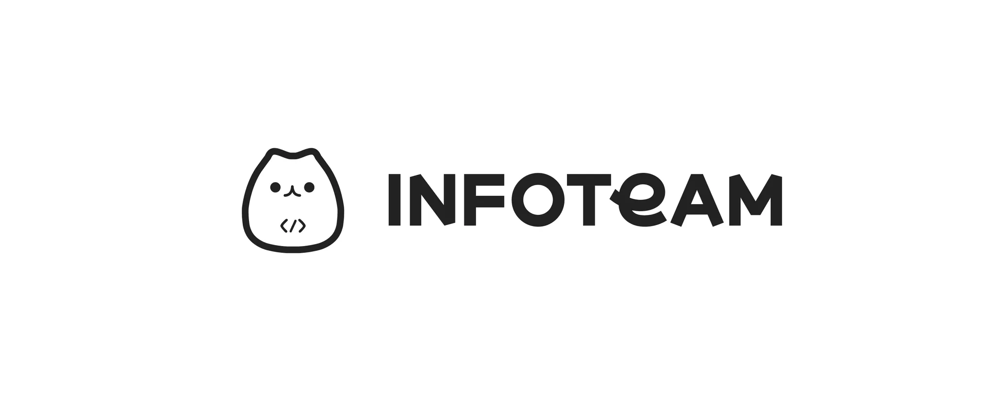

<!-- markdownlint-disable MD041 -->


# Ziggle-backend

## Description

Ziggle의 Backend

## Entity relation diagram

현재, ERD는 다음 링크에서 mermaid로 구현되어 있습니다. [ERD 링크](./docs/erd.md)

## Installation

```bash
$ npm install
```

## Running the app

```bash
# development
$ npm run start

# watch mode
$ npm run start:dev

# production mode
$ npm run start:prod
```

## Test

```bash
# unit tests
$ npm run test

# e2e tests
$ npm run test:e2e

# test coverage
$ npm run test:cov
```
