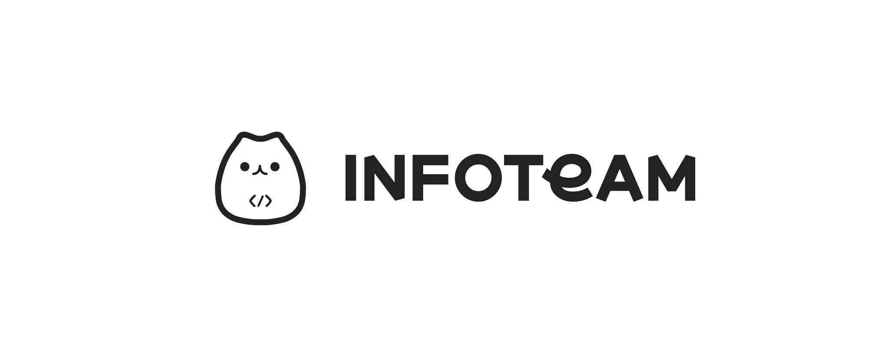

<!-- markdownlint-disable MD041 -->


# Ziggle-backend

## Description

Ziggle의 Backend

## Entity relation diagram

현재, ERD는 다음 링크에서 mermaid로 구현되어 있습니다. [ERD 링크](./docs/erd.md)

## Installation

```bash
$ npm install
```

## Running the app

```bash
# development
$ npm run start

# watch mode
$ npm run start:dev

# production mode
$ npm run start:prod
```

## Chatbot MCP server

Set `MCP_API_KEY` to a secret of at least 32 characters. MCP requests must send
it in the `X-Api-Key` header. If the key is unset, MCP requests return `401`.
Connect an MCP client to `POST /mcp` using the Streamable HTTP transport.

The server exposes two tools:

- `search_notices` accepts a `query` and optional `limit` (1–50, defaults to
  10). It searches existing notice content and returns matching `id`, `title`,
  and `summary` values.
- `get_notice` accepts an `id` and returns the notice's `id` and original
  `body`.

## Test

```bash
# unit tests
$ npm run test

# e2e tests
$ npm run test:e2e

# test coverage
$ npm run test:cov
```
