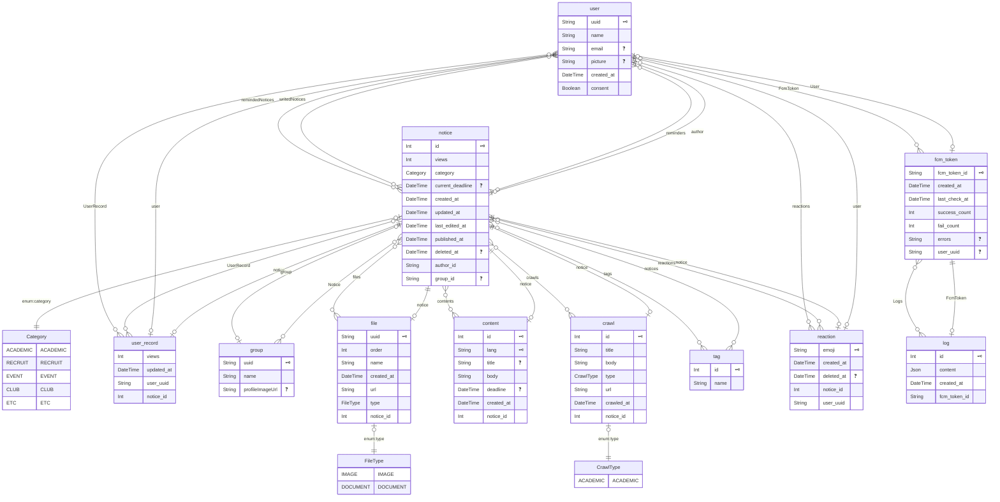

```mermaid
erDiagram

        FileType {
            IMAGE IMAGE
DOCUMENT DOCUMENT
        }
    


        CrawlType {
            ACADEMIC ACADEMIC
        }
    


        Category {
            ACADEMIC ACADEMIC
RECRUIT RECRUIT
EVENT EVENT
CLUB CLUB
ETC ETC
        }
    
  "user" {
    String uuid "🗝️"
    String name 
    String email "❓"
    String picture "❓"
    DateTime created_at 
    Boolean consent 
    }
  

  "user_record" {
    Int views 
    DateTime updated_at 
    String user_uuid 
    Int notice_id 
    }
  

  "group" {
    String uuid "🗝️"
    String name 
    String profileImageUrl "❓"
    }
  

  "file" {
    String uuid "🗝️"
    Int order 
    String name 
    DateTime created_at 
    String url 
    FileType type 
    Int notice_id 
    }
  

  "content" {
    Int id "🗝️"
    String lang "🗝️"
    String title "❓"
    String body 
    DateTime deadline "❓"
    DateTime created_at 
    Int notice_id 
    }
  

  "crawl" {
    Int id "🗝️"
    String title 
    String body 
    CrawlType type 
    String url 
    DateTime crawled_at 
    Int notice_id 
    }
  

  "tag" {
    Int id "🗝️"
    String name 
    }
  

  "notice" {
    Int id "🗝️"
    Int views 
    Category category 
    DateTime current_deadline "❓"
    DateTime created_at 
    DateTime updated_at 
    DateTime last_edited_at 
    DateTime published_at 
    DateTime deleted_at "❓"
    String author_id 
    String group_id "❓"
    }
  

  "reaction" {
    String emoji "🗝️"
    DateTime created_at 
    DateTime deleted_at "❓"
    Int notice_id 
    String user_uuid 
    }
  

  "fcm_token" {
    String fcm_token_id "🗝️"
    DateTime created_at 
    DateTime last_check_at 
    Int success_count 
    Int fail_count 
    String errors "❓"
    String user_uuid "❓"
    }
  

  "log" {
    Int id "🗝️"
    Json content 
    DateTime created_at 
    String fcm_token_id 
    }
  
    "user" o{--}o "notice" : "remindedNotices"
    "user" o{--}o "notice" : "writedNotices"
    "user" o{--}o "reaction" : "reactions"
    "user" o{--}o "user_record" : "UserRecord"
    "user" o{--}o "fcm_token" : "FcmToken"
    "user_record" o|--|| "user" : "user"
    "user_record" o|--|| "notice" : "notice"
    "group" o{--}o "notice" : "Notice"
    "file" o|--|| "FileType" : "enum:type"
    "file" o|--|| "notice" : "notice"
    "content" o|--|| "notice" : "notice"
    "crawl" o|--|| "CrawlType" : "enum:type"
    "crawl" o|--|| "notice" : "notice"
    "tag" o{--}o "notice" : "notices"
    "notice" o|--|| "Category" : "enum:category"
    "notice" o{--}o "user" : "reminders"
    "notice" o|--|| "user" : "author"
    "notice" o{--}o "file" : "files"
    "notice" o{--}o "content" : "contents"
    "notice" o{--}o "crawl" : "crawls"
    "notice" o{--}o "tag" : "tags"
    "notice" o{--}o "reaction" : "reactions"
    "notice" o|--|o "group" : "group"
    "notice" o{--}o "user_record" : "UserRecord"
    "reaction" o|--|| "notice" : "notice"
    "reaction" o|--|| "user" : "user"
    "fcm_token" o|--|o "user" : "User"
    "fcm_token" o{--}o "log" : "Logs"
    "log" o|--|| "fcm_token" : "FcmToken"
```
