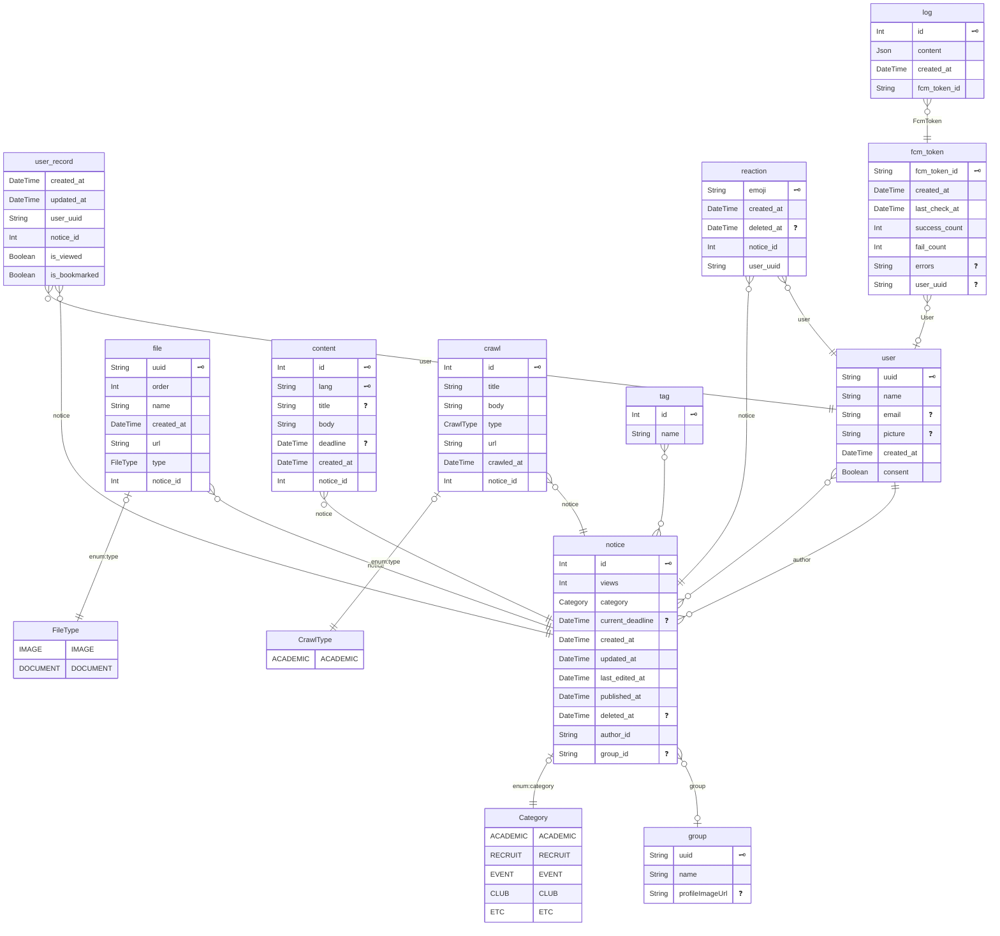

```mermaid
erDiagram

        FileType {
            IMAGE IMAGE
DOCUMENT DOCUMENT
        }
    


        CrawlType {
            ACADEMIC ACADEMIC
        }
    


        Category {
            ACADEMIC ACADEMIC
RECRUIT RECRUIT
EVENT EVENT
CLUB CLUB
ETC ETC
        }
    
  "user" {
    String uuid "🗝️"
    String name 
    String email "❓"
    String picture "❓"
    DateTime created_at 
    Boolean consent 
    }
  

  "user_record" {
    DateTime created_at 
    DateTime updated_at 
    String user_uuid 
    Int notice_id 
    Boolean is_viewed 
    Boolean is_bookmarked 
    }
  

  "group" {
    String uuid "🗝️"
    String name 
    String profileImageUrl "❓"
    }
  

  "file" {
    String uuid "🗝️"
    Int order 
    String name 
    DateTime created_at 
    String url 
    FileType type 
    Int notice_id 
    }
  

  "content" {
    Int id "🗝️"
    String lang "🗝️"
    String title "❓"
    String body 
    DateTime deadline "❓"
    DateTime created_at 
    Int notice_id 
    }
  

  "crawl" {
    Int id "🗝️"
    String title 
    String body 
    CrawlType type 
    String url 
    DateTime crawled_at 
    Int notice_id 
    }
  

  "tag" {
    Int id "🗝️"
    String name 
    }
  

  "notice" {
    Int id "🗝️"
    Int views 
    Category category 
    DateTime current_deadline "❓"
    DateTime created_at 
    DateTime updated_at 
    DateTime last_edited_at 
    DateTime published_at 
    DateTime deleted_at "❓"
    String author_id 
    String group_id "❓"
    }
  

  "reaction" {
    String emoji "🗝️"
    DateTime created_at 
    DateTime deleted_at "❓"
    Int notice_id 
    String user_uuid 
    }
  

  "fcm_token" {
    String fcm_token_id "🗝️"
    DateTime created_at 
    DateTime last_check_at 
    Int success_count 
    Int fail_count 
    String errors "❓"
    String user_uuid "❓"
    }
  

  "log" {
    Int id "🗝️"
    Json content 
    DateTime created_at 
    String fcm_token_id 
    }
  
    "user" o{--}o "notice" : ""
    "user_record" }o--|| user : "user"
    "user_record" }o--|| notice : "notice"
    "file" |o--|| "FileType" : "enum:type"
    "file" }o--|| notice : "notice"
    "content" }o--|| notice : "notice"
    "crawl" |o--|| "CrawlType" : "enum:type"
    "crawl" }o--|| notice : "notice"
    "tag" o{--}o "notice" : ""
    "notice" |o--|| "Category" : "enum:category"
    "notice" }o--|| user : "author"
    "notice" }o--|o group : "group"
    "reaction" }o--|| notice : "notice"
    "reaction" }o--|| user : "user"
    "fcm_token" }o--|o user : "User"
    "log" }o--|| fcm_token : "FcmToken"
```
